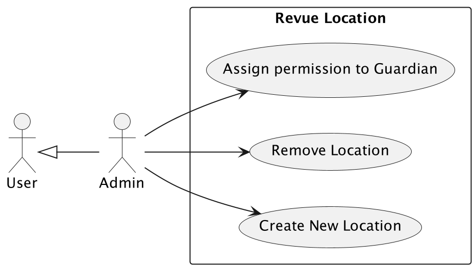
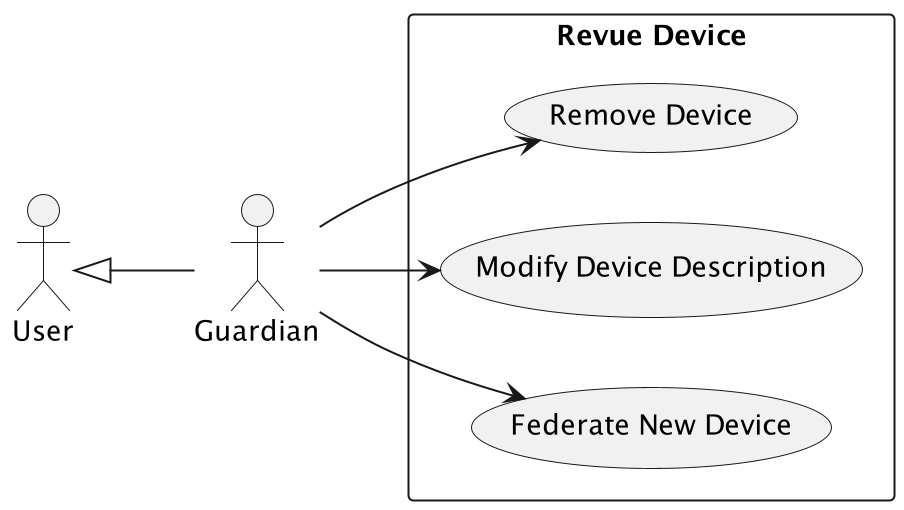
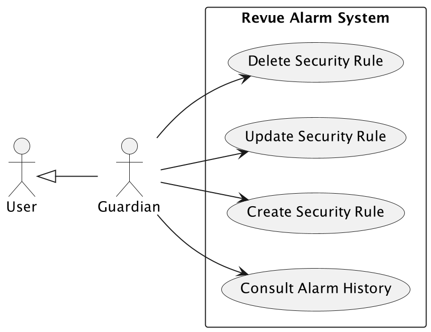

# Analysis

## Glossary

During the initial analysis phase, we collected the main terms and definitions that will be the basis for the
requirements' engineering and the system's design.

| Term          | Meaning                                                                            |
|---------------|------------------------------------------------------------------------------------|
| Camera        | Device that generates a video stream and sends it to the other parts of the system |
| Sensor        | Device capturing sensing data from an environment (e.g. temperature)               |
| Device        | Either a camera or a sensor                                                        |
| Video Stream  | Stream of video data produced by a camera                                          |
| Measurement   | Data produced by a sensor                                                          |
| User          | User that can access the system                                                    |
| Detection     | Recognition of an object in a video stream                                         |
| Intrusion     | Detection of an unauthorized object                                                |
| Outlier       | Environment value exceeding user defined ranges                                    |
| Anomaly       | Either an intrusion or an outlier                                                  |
| Security Rule | Rule defined by an user to trigger anomalies in a defined range of time            |
| Location      | Rooms or buildings where devices are located                                       |
| Notification  | An alert sent to the user to inform that an anomaly has been triggered.            |

## Business Requirements

In this section, we will define the business requirements of the system due to the user roles and prospective
functionalities.
There are two main roles: the **Admin** and the **Guardian**,
where not specified the role is referred to the **Guardian**.

### User Creation

A registered Admin can create a new user in the system.
The user will have access to the system and will be able to consult the devices depending on the location permissions.

1. Register a new user in the system.

    - **Actor**: Admin
    - **Precondition**: The admin is logged in the system, and the user is not registered yet.
    - **Post condition**: The user is created in the system, can access the system and consult the devices depending on
      his
      permissions.
    - **Flow**:
        1. The admin moves to the "Create User" section.
        2. The admin fills the user information.
        3. The admin selects the locations that the user can access.
        4. The system after precise checks creates the user.
    - **Main Success Scenario**:
        1. The user is created in the system.
    - **Extensions**:
        1. The user already exists in the system.
        2. The user information is not filled correctly.

2. Modify user information and permissions.

    - **Actor**: Admin
    - **Precondition**: The admin is logged in the system, and the user is registered.
    - **Post condition**: The user information is updated in the system.
    - **Flow**:
        1. The admin moves to the "Update User" section.
        2. The admin selects the user to update.
        3. The admin updates the user information.
        4. The admin updates the user permissions.
        5. The system after precise checks updates the user.
    - **Main Success Scenario**:
        1. The user information is updated in the system.
    - **Extensions**:
        1. The information is not filled correctly, in this case, the system will not update the user information and
           will
           show an error message.

3. Modify user contact information.

    - **Actor**: Admin
    - **Precondition**: The admin is logged in the system, and the user is registered.
    - **Post condition**: The user contact information is updated in the system.
    - **Flow**:
        1. The admin moves to the "Update User" section.
        2. The admin selects the user to update.
        3. The admin updates the user contact information.
        4. The system updates the user.
    - **Main Success Scenario**:
        1. The user contact information is updated in the system.

4. Delete user.

    - **Actor**: Admin
    - **Precondition**: The admin is logged in the system, and the user is registered.
    - **Post condition**: The user is deleted from the system.
    - **Flow**:
        1. The admin moves to the "Delete User" section.
        2. The admin selects the user to delete.
        3. The system after precise checks deletes the user.
    - **Main Success Scenario**:
        1. The user is deleted from the system.

### Location Management

A registered Admin can create a new location in the system.
Every device resides in a location.
The final user can consult it only if he has access to the location.

1. Create a new location.

    - **Actor**: Admin
    - **Precondition**: The admin is logged in the system, and the location is not present yet.
    - **Post condition**: The location is created in the system.
    - **Flow**:
        1. The admin moves to the "Location" section and opens the "Create Location" popup.
        2. The admin fills the location information.
        3. The system creates the location.
    - **Main Success Scenario**:
        1. The location is created in the system.
        2. The admin can see the location in the location list.
    - **Extensions**:
        1. The location already exists in the system (error message).

2. Remove location.

    - **Actor**: Admin
    - **Precondition**: The admin is logged in the system, and the location is present.
    - **Post condition**: The location is deleted from the system.
    - **Flow**:
        1. The admin moves to the "Location" section and selects the location to delete.
        2. The admin click on the remove icon.
        3. The system deletes the location.
    - **Main Success Scenario**:
        1. The location is deleted from the system, and the admin can't see it in the location list.

### Device Management

A registered User can federate a device in the system. The user can consult the device information and consult real-time
data. Morehover the user can modify the device description.

1. Federate a device.

    - **Actor**: User
    - **Precondition**:
        1. The user is logged in the system.
        2. The device has an exposed IP address.
        3. The device adheres to the system protocol.
        4. The device exposes some capabilities.
        5. The device is not federated yet.
    - **Post condition**:
        1. The device is federated in the system.
        2. The user can consult the device information.
        3. The user can consult the real-time data.
    - **Flow**:
        1. The user moves to the "Device" section and opens the "Add Device" popup.
        2. The user fills the device's IP address and port.
        3. The user selects the "Retrieve Device Information" button.
        4. The system retrieves the device information and fills the device information fields.
        5. The user fills the device description and sees the device's capabilities.
        6. The user finally selects the "Create" button.
        7. The system after retrieving device's information federates the device.
    - **Main Success Scenario**:
        1. The device is federated in the system.
        2. The user can see the device in the device list.
        3. The user can consult the device information.
        4. The user can consult the real-time data due to device capabilities.
        5. The user can see precise information about device capabilities.
    - **Extensions**:
        1. The device is not reachable (error message).
        2. The device is not compliant with the system protocol (error message).
        3. The device is already federated in the system (error message).
        4. The device is reachable and compliant but doesn't expose any capabilities (error message).

2. Modify device description.

    - **Actor**: User
    - **Precondition**:
        1. The user is logged in the system.
        2. The device is federated in the system.
    - **Post condition**:
        1. The device description is updated in the system.
    - **Flow**:
        1. The user moves to the "Device" section and selects the device to update.
        2. The user clicks on the "Update" button.
        3. The user updates the device description.
        4. The system updates the device description.
    - **Main Success Scenario**:
        1. The device description is updated in the system.
    - **Extensions**:
        1. The device is not reachable (error message).

3. Remove device.

    - **Actor**: User
    - **Precondition**:
        1. The user is logged in the system.
        2. The device is federated in the system.
    - **Post condition**:
        1. The device is removed from the system.
    - **Flow**:
        1. The user moves to the "Device" section and selects the device to remove.
        2. The user clicks on the "Remove" button.
        3. The system removes the device.
    - **Main Success Scenario**:
        1. The device is removed from the system.

### Environment Data Monitoring

A registered User can consult the environment data in real-time. The user can select a monitoring measure and consult
the measure information. It's possible only if the user has access to the device depending on the location permissions.

1. Consult real-time environment data.

    - **Actor**: User
    - **Precondition**:
        1. The user is logged in the system.
        2. The device is federated in the system.
        3. The device exposes some capabilities; in particular, the sensing capabilities are required in this case.
        4. The device is providing real-time data.
    - **Post condition**:
        1. The user can see the real-time data and choose the desired monitoring measure.
    - **Flow**:
        1. The user moves to the "Monitoring" section and select the device to monitor.
        2. The user selects the monitoring measure.
        3. The system retrieves the real-time data and shows it to the user.
    - **Main Success Scenario**:
        1. The user can see the real-time data with an interval that depends on the device capabilities (intervalMillis
           property of the Sensing capabilities).
        2. The user can see the monitoring measure and unit in a graph.
        3. The user can see the last value of the monitoring measure.
    - **Extensions**:
        1. The device is not providing real-time data (error message).
        2. The system shows only measures supported by device capabilities.

2. Consult monitoring measure history.

    - **Actor**: User
    - **Precondition**:
        1. The user is logged in the system.
        2. The device is federated in the system.
        3. The device has provided some data to the system.
    - **Post condition**:
        1. The user can see the monitoring measure history.
    - **Flow**:
        1. The user moves to the "History."
        2. The user selects the "Measurement" property to consult.
        3. The system retrieves the monitoring measure history and shows it to the user.
    - **Main Success Scenario**:
        1. The user can see the monitoring measure and unit history.

### Video Streaming Monitoring

A registered User can consult the video streaming produced by a specific camera in real-time.
The user can see the video streaming only if he has access to the device depending on the permissions.

1. Consult video streaming.

    - **Actor**: User
    - **Precondition**:
        1. The user is logged in the system.
        2. The device is federated in the system.
        3. The device exposes some capabilities; in particular, the video streaming capabilities are required in this
           case.
        4. The device is active and providing video streaming.
    - **Post condition**:
        1. The user can see the video streaming produced by the camera.
        2. The produced video streaming is in real-time and available for the alarm service in case of security rules.
    - **Flow**:
        1. The user moves to the "Video Streaming" section and selects the camera to monitor.
        2. The system retrieves the video streaming and shows it to the user.
    - **Main Success Scenario**:
        1. The user can see the video streaming produced by the camera in real-time.

### Alarm Management

A registered User can consult the alarm history and create security rules. The user can define the conditions that
trigger an alarm and update/delete the security rules.
A component of the alarm service will check the security rules and trigger an alarm if the conditions are satisfied,
notifying the user.

1. Consult alarm history.

    - **Actor**: User
    - **Precondition**:
        1. The user is logged in the system.
        2. The alarm service has triggered some alarms.
    - **Post condition**:
        1. The user can see the alarm history.
    - **Flow**:
        1. The user moves to the "History" section.
        2. The user selects the alarm property to consult: "Intrusions" or "Outliers."
        3. The system retrieves the alarm history and shows it to the user due to his choice.
    - **Main Success Scenario**:
        1. The user can see the alarm history.
        2. The user can see the alarm type, the device that triggered the alarm, the date and time of the alarm.
           **Extensions**:
        3. The alarm service has not triggered any alarm yet.

2. Create security rule.

    - **Actor**: User
    - **Precondition**:
        1. The user is logged in the system.
        2. The device is federated in the system.
        3. The device exposes some capabilities.
        4. The device is providing real-time data (streaming or environment data).
    - **Post condition**:
        1. The user can see the security rule in the security rule list.
        2. The alarm service will check the security rule and trigger an alarm if the conditions are satisfied (also a
           notification will be sent).
        3. The user can see the alarm in the alarm history.
    - **Flow**:
        1. The user moves to the "Security Rule" section and open the "Add Security Rule" popup.
        2. The user fills the security rule description.
        3. The user selects the device to monitor.
        4. The user selects the monitoring measure or the object class to monitor and recognize.
        5. The user fills the threshold value in case of measure monitoring.
        6. The user selects the time interval to check the condition.
        7. The user selects the contacts to notify in case of alarm.
        8. The user selects the "Create" button.
        9. The system creates the security rule, and the alarm service will start checking the security rule due to his
           properties.
    - **Main Success Scenario**:
        1. The security rule is created in the system.
        2. The user can see the security rule in the security rule list.
        3. The alarm service will check the security rule and trigger an alarm if the conditions are satisfied.
        4. The user can see if the rule is currently active or not.
        5. The user can see the contacts to notify in case of alarm.
    - **Extensions**:
        1. The device is not providing real-time data, so nothing will be monitored.

3. Update security rule.

    - **Actor**: User
    - **Precondition**:
        1. The user is logged in the system.
        2. The security rule is created.
        3. The user can see the security rule in the security rule list.
    - **Post condition**:
        1. The user can see the updated security rule in the security rule list.
        2. The alarm service will check the updated security rule and trigger an alarm if the conditions are satisfied (
           also
           a notification will be sent).
    - **Flow**:
        1. The user moves to the "Security Rule" section and selects the security rule to update.
        2. The user clicks on the "Update" icon.
        3. The user updates the security rule description, time interval or contacts to notify.
        4. The user selects the "Update" button.
        5. The system updates the security rule and the alarm service will start checking the security rule due to his
           new
           properties.
    - **Main Success Scenario**:
        1. The security rule is updated in the system.
        2. The user can see the updated security rule in the security rule list.
        3. The alarm service will check the updated security rule and trigger an alarm if the conditions are satisfied.

4. Delete security rule.

    - **Actor**: User
    - **Precondition**:
        1. The user is logged in the system.
        2. The security rule is created.
        3. The user can see the security rule in the security rule list.
    - **Post condition**:
        2. The alarm service will not check the deleted security rule anymore.
    - **Flow**:
        1. The user moves to the "Security Rule" section and selects the security rule to delete.
        2. The user clicks on the "Delete" icon.
        3. The system deletes the security rule.
    - **Main Success Scenario**:
        1. The security rule is deleted from the system.
        2. The user can't see the deleted security rule in the security rule list.
        3. The alarm service will not check the deleted security rule anymore.

### Notification Management

A registered User can consult the notification history.
The user can see the notifications that have been sent by the system.
Moreover, the user can see the notification type, the date and other notification properties.
When an alarm is triggered, the system will send a notification to the contacts specified in the security rule and in
real-time if some users are logged in the system.

1. Consult notification history.

    - **Actor**: User
    - **Precondition**:
        1. The user is logged in the system.
    - **Post condition**:
        1. The user can see the notification history.
    - **Flow**:
        1. The user moves to the "Notification" section.
        2. The system retrieves the notification history and shows it to the user.
    - **Main Success Scenario**:
        1. The user can see the notification history.
        2. The user can see the notification type, the date and other notification properties.
    - **Extensions**:
        1. The system has not sent any notification yet.

2. Consult real-time notification.

    - **Actor**: User
    - **Precondition**:
        1. The user is logged in the system and online.
        2. An alarm is triggered.
    - **Post condition**:
        1. The user can see the real-time notification.
    - **Flow**:
        1. The user is logged in the system.
        2. The system sends a notification to the user.
        3. The user can see the notification in real-time and consult it.
    - **Main Success Scenario**:
        1. The user can see the real-time notification.
        2. The user can see the notification type, the date and other notification properties.

## Functional Requirements

1. User Management
    1. The system should allow two types of users: **Admin** and **Guardian**.
    2. Users can log in to the system.
    3. Admin possibility to create a new user of type Guardian.
    4. Admin possibility to modify Guardians information.
    5. Possibility to remove a Guardian.
    6. Permission and Contact management by the Admin.
2. Location Management
    1. Admin possibility to create a new location.
    2. Admin possibility to remove a location.
3. Device Management
    1. Guardian possibility to federate a device.
    2. Guardian possibility to modify device description.
    3. Guardian possibility to enable and disable a device.
    4. Guardian possibility to remove a device.
4. Monitoring
    1. Consult real-time environment data through a graph.
    2. Consult video streaming.
5. Alarm Management
    1. Possibility to create a security rule.
    2. Possibility to update a security rule.
    3. Possibility to delete a security rule.
6. Notification Management
    1. Consult all the notifications sent by the system.
    2. Possibility to receive real-time notifications.
    3. Possibility to receive notifications when an alarm is triggered due to a security rule.
7. History
    1. Consult the history of produced data.
    2. Consult the history of alarms triggered (**Intrusions** or **Outliers**).

### User Stories

- **User**:
    1. As an **Admin**,\
       \[I want to\] create a new user in the system,\
       \[so that\] the user can access the system and consult the system.

    2. As an **Admin**,\
       \[I want to\] modify user contacts information,\
       \[so that\] the user contacts are updated in the system.

    3. As an **Admin**,\
       \[I want to\] modify (add/remove) user permissions,\
       \[so that\] the user permissions are updated in the system.

    4. As an **Admin**,\
       \[I want to\] delete a user from the system,\
       \[so that\] the user is removed from the system.

- **Location**:
    1. As an **Admin**,\
       \[I want to\] create a new location in the system,\
       \[so that\] the location is created in the system and i can assign Guardians to it.

    2. As an **Admin**,\
       \[I want to\] delete a location from the system,\
       \[so that\] the location is removed from the system and Guardians can't access it anymore.

- **Device**:
    1. As a **Guardian**,\
       \[I want to\] federate a device in the system,\
       \[so that\] the device is federated in the system, and I can consult the device information and real-time data
       due to its capabilities.

    2. As a **Guardian**,\
       \[I want to\] modify the device description,\
       \[so that\] the device description is updated in the system.

    3. As a **Guardian**,\
       \[I want to\] enable or disable a device in the system,\
       \[so that\] the device is enabled or disabled in the system, producing or not real-time data.

    4. As a **Guardian**,\
       \[I want to\] delete a device from the system,\
       \[so that\] the device is removed from the system.

- **Monitoring**:
    1. As a **Guardian**,\
       \[I want to\] consult the real-time environment data produced by a specific device with some sensing
       capabilities,\
       \[so that\] I can see some data, choose the desired monitoring measure and consult the measurement value and
       unit.

    2. As a **Guardian**,\
       \[I want to\] consult the video streaming produced by a specific device with some video streaming capabilities,\
       \[so that\] I can see the video streaming produced by the device.

- **Security Rule Management**:
    1. As a **Guardian**,\
       \[I want to\] create a security rule in the system,\
       \[so that\] the alarm service will check the security rule and trigger an alarm if the conditions are satisfied.

    2. As a **Guardian**,\
       \[I want to\] update a security rule in the system,\
       \[so that\] the alarm service will check the updated security rule and trigger an alarm if the new conditions are
       satisfied.

    3. As a **Guardian**,\
       \[I want to\] delete a security rule from the system,\
       \[so that\] the alarm service will not check the deleted security rule anymore.

- **Notification**:
    1. As a **Guardian**,\
       \[I want to\] consult the notifications sent by the system,\
       \[so that\] I can see the notification type, the date and other notification properties.

    2. As a **Guardian**,\
       \[I want to\] receive real-time notifications through broken security rule's specified contacts, when an alarm is
       triggered,\

    - \[so that\] I can see the notification in real-time and consult it.

- **History**:
    1. As a **Guardian**,\
       \[I want to\] consult the history of produced data and alarms triggered,\
       \[so that\] I can see the history and eventually take some actions.

## Quality Attributes

Quality attributes are non-functional requirements that define the system's main properties exploited for
guiding architectural decisions to ensure and meet the properties below.

### Overview

The system should be designed to meet the following quality attributes.
In particular:

- Runtime
    1. The system should be modular and reliable:
        - The system should work even though some component is down or not deployed.
        - The system should work even though some component responsible for the storage of the data is down or not
          deployed.
        - The system should work with authenticated users even though the component responsible for the authentication
          is down.
    2. The system should be as much as possible available (and also replicable).
    3. The system should support many users at the same time.
    4. The system should be scalable and should support many devices.
    5. The system should be secure guaranteeing the user's data privacy and system integrity.
    6. The system should be observable, providing real-time monitoring, dashboards and logs.

- Development Time
    1. The system should be usable with a user-friendly and minimal interface.
    2. The system should be testable, with automated unit and integration tests.
    3. The system should be maintainable, with the possibility to fix bugs and add new features without affecting the
       system's overall functionality.
    4. The system should be deployable, with the possibility to deploy a new version of the software with zero downtime,
       without affecting active users and without manual intervention.
    5. The system should be modifiable, with the possibility to add new features or modify existing ones without
       affecting
       all modules or the overall system functionality.

### Identified Quality Scenarios

#### Scalability

**Stimulus**: An unexpected increase in the number of users accessing the system.\
**Stimulus Source**: Many users access the system simultaneously.\
**Environment**: During peak usage hours.\
**Artifact**: The main service parts, such as the frontend and monitoring services.\
**Response**: The system should scale horizontally by adding more instances of the frontend servient and monitoring
service to handle the increased load.
**Response Measure**:
The system maintains response times under 5 seconds for 90% of the requests even under increased load.

#### Availability

**Stimulus**: A critical failure occurs and a service becomes unavailable.\
**Stimulus Source**: A hardware failure or a network outage.\
**Environment**: The system in its normal operational state.\
**Artifact**: The service that becomes unavailable.\
**Response**: The system automatically detects the failure and redirects traffic to a redundant service.\
**Response Measure**: The system remains available with a downtime of less than 5 minutes.\

#### Data processing

**Stimulus**: Thousands of WoT devices send data to the system.\
**Stimulus Source**: Devices distributed across various locations.\
**Environment**: The system is in real-time data processing mode (normal production operational state).\
**Artifact**: The data ingestion and processing pipeline.
**Response**: The system ingests and processes the data from all devices in real-time.
**Response Measure**: The system processes 99% of the devices' data within 100 milliseconds of receipt.

#### Reliability

**Stimulus**: A software fault occurs in one of the system’s services.
**Stimulus Source**: An unexpected software bug causes a service to fail.
**Environment**: The system is running in a production environment in its normal operational state.
**Artifact**: The affected service(s).
**Response**: The system automatically detects the failure and restarts the affected service,
while maintaining overall system stability.
**Response Measure**: The affected service is restored immediately after the failure is detected,
and no data should be lost or corrupted as a result of the failure.

#### Observability

**Stimulus**: Something goes wrong in the system.
**Stimulus Source**: The monitoring system detects the anomaly.
**Environment**: The system is in its normal operational state.
**Artifact**: The system’s monitoring infrastructure.
**Response**:
The system automatically logs detailed diagnostic information and provides real-time dashboards for investigation.
**Response Measure**: The cause can be identified analyzing the logs and dashboards at any time.

#### Security

**Stimulus**: An unauthorized user attempts to directly access restricted services.
**Stimulus Source**: A malicious user.
**Environment**: The system in its normal operational state.
**Artifact**: The gateway service that controls access to services.
**Response**: The system blocks the access attempt.
**Response Measure**: The unauthorized access is blocked immediately.

#### Testability

**Stimulus**: A new feature is added to the system.
**Stimulus Source**: The development team or an external contribution.
**Environment**: The system in an active development phase.
**Artifact**: The newly added feature.
**Response**: Automated tests are executed to verify the functionality of the new feature.
**Response Measure**: Automated tests (integration and unit) that provide results within few minutes.

#### Maintainability

**Stimulus**: An issue is reported in the GitHub issue tracker.
**Stimulus Source**: A user submits an issue report.
**Environment**: The system is in its normal operational state but with a reported bug.
**Artifact**: The affected component.
**Response**: The development team identifies the bug, applies a fix, tests the corrected component and deploys the fix.
**Response Measure**: The bug is resolved and deployed to production following the gravity of the issue.

#### Deployability

**Stimulus**: A new version of the software is ready for deployment.
**Stimulus Source**: The development team has completed all necessary updates or features.
**Environment**: The system is in its normal operational state and a new version is ready for deployment.
**Artifact**: The entire system, including all components and services.
**Response**: The new version is deployed with zero downtime and without affecting active users. No manual intervention
is required.
**Response Measure**: The deployment is completed within minutes with no incidents or the deployment is rolled back (
failed).

#### Modularity

**Stimulus**: A new feature to a module or an entire module needs to be added to the system.
**Stimulus Source**: A product enhancement, a change in requirements, a bug fix or a new feature.
**Environment**: The system is in its normal operational state, and the new part of the system is ready for deployment.
**Artifact**: The specific module that will be modified and their dependencies.
**Response**:
The development team implements the new feature without affecting other modules or the overall system functionality,
helped from integration tests.
**Response Measure**: The feature is added with no changes required in other modules,
and the implementation is completed within the estimated time frame.

#### User-Friendliness

**Stimulus**: A new user attempts to complete a specific task or a non-technical user interacting with the system.
**Stimulus Source**: A not particularly expert user.
**Environment**: The system is running in its normal operational state.
**Artifact**: The frontend (user interface), specifically the portion related to the task.
**Response**: The frontend is designed to be intuitive and easy to use, with clear instructions and minimal complexity.
**Response Measure**: The user completes the task successfully with a positive rates in a eventual survey.
