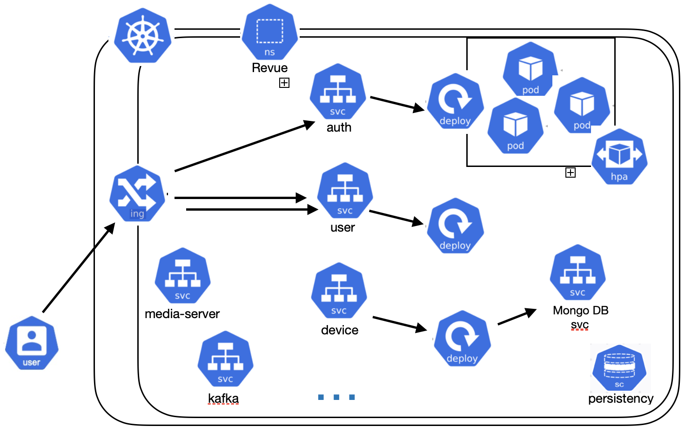
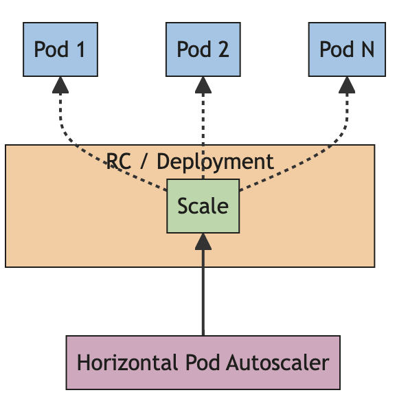

# Deployment

Revue offers two deployment methods: **Docker Compose** to simplify the development phase and **Kubernetes** for
production.
Each method comes with prerequisites, a guide, and component details.

## Docker

This section explains how to deploy Revue using Docker Compose,
breaking down the system into containers for each service,
plus additional components such as **Zookeeper**, **Kafka** (broker), and a **Media Server** for video streaming.

### Prerequisites

- Docker

### Step-by-step guide

#### Deploy the entire system

1. Clone the project from [Revue](https://github.com/revue-org/revue).
2. Navigate to the project root.
3. Run the `./deploy.sh --docker` command.

Once the system is up and running, the web interface entrypoint is available at http://localhost:8080.

The credentials of the example user are:

- Username: `user`
- Password: `user`

To shut down the system, run the `./undeploy.sh --docker` command.

The system deploys containers for microservices and essential components like **Zookeeper**
(for **Kafka**) and **MediaMTX Media Server**.
Additionally, a container is deployed to simulate a physical device,
which can be explored in the [Sample Thing](https://github.com/revue-org/revue-sample-thing)

#### Deploy a subset of the system

Other scripts are available to start the system differently to:

- Deploy only some services with their databases, using the `compose-service.sh` script.
- Deploy only databases, using the `compose-db.sh` script.

Usage examples:

```bash 
./scripts/compose-service.sh --up <SERVICES>
```

```bash
./scripts/compose-db.sh --up <SERVICES>
``` 

where `<SERVICES>` is a list of services separated by a space (e.g. `auth user monitoring`).

NB: Every script has to be launched from the root of the project

These scripts are useful for testing or debugging specific services.

## Kubernetes

For production environments, Revue can be deployed using **Kubernetes**.
The system is mapped to Kubernetes components like **Deployments**,
**Services**, **Ingress**, **Persistent Volume Claims**, and **ConfigMaps**.

In particular, for core services of the system, the following configurations are provided:

- **Deployment**: responsible for creating pods and managing their lifecycle.
- **Service**: type ClusterIP, with no need to be exposed outside the cluster due to the presence of the Ingress Controller (API Gateway).
- **Ingress**: to expose the service outside the cluster through the Ingress Controller.
- **Persistent Volume Claim**: to store data that needs to persist even after the pod is deleted.
- **ConfigMap**: to store configuration data and database initialization scripts.
- **Horizontal Pod Autoscaler**: to automatically adjust the number of Pods in a workload based on current demand.

Every service is accessible through the Ingress Controller,
which is responsible for routing the requests to the correct service.
In this case, the Ingress Controller is [Traefik](https://traefik.io/),
a modern HTTP reverse proxy and load balancer that can be used to expose services outside the cluster.



### Prerequisites

- A Kubernetes cluster running
- `kubectl` installed
- `Helm Charts` installed

With Revue, it is also provided a guide to creating a K3s cluster on Raspberry PIs 5
that can be found [here](https://github.com/revue-org/revue-k3s-deployment).

### Step-by-step guide

Before deployment, you'll need the Revue configuration files and an active Load Balancer,
provided either by your cloud provider or installed manually on bare-metal environments.

1. Install the Ingress Controller, in this case, Traefik:
      ```bash
      helm repo add traefik https://traefik.github.io/charts
      helm repo update
      helm install traefik traefik/traefik --values gateway/traefik-values.yml
      ```
2. Install Grafana.
      ```bash
        helm repo add grafana https://grafana.github.io/helm-charts
        helm repo update
        helm install grafana grafana/grafana -f prometheus/grafana-values.yml --namespace YOUR_NAMESPACE
      ````
3. Install Prometheus.
      ```bash
      helm repo add prometheus-community https://prometheus-community.github.io/helm-charts
      helm repo update
      helm install prometheus prometheus-community/prometheus -f prometheus/prometheus-values.yml
      ```
4. Install or check for a Load Balancer, such as ([MetalLB](https://metallb.universe.tf/installation/)).
   A guide for Raspberry Pi deployment can be found here.

### Deploy the System

1. Download the YAML configurations
   file [here](https://github.com/revue-org/revue-k3s-deployment/tree/main/specifications/k3s).
2. Enter the folder where the files are downloaded.
3. Run:

```bash
 kubectl apply -f .
```

This deploys core services, each with its **Deployment**, **Service** (**ClusterIP** for internal exposure), **Ingress
**, **Persistent Volume Claims**, and **ConfigMaps**.

#### Notes

- The system uses [Traefik](https://traefik.io/traefik/) as the Ingress Controller and reverse proxy.
- LoadBalancer services require either an external load balancer from a cloud provider or manual installation on
  bare-metal.

### Horizontal pod autoscaling 

A [HorizontalPodAutoscaler](https://kubernetes.io/docs/tasks/run-application/horizontal-pod-autoscale/) (HPA)
in Kubernetes automatically adjusts the number of Pods in a workload based on current demand.
It scales the workload horizontally by increasing or decreasing the number of Pods in response to load changes. 



The scaling is based on specific configurations file where limits of resources are defined.
This helped us to meet QA requirements and to optimize the resources used by the system, limiting the costs.

Example of a configuration file targeting CPU usage:
```yaml
  metrics:
    - type: Resource
      resource:
        name: cpu                            # Scale based on CPU usage
        target:
          type: Utilization
          averageUtilization: 60             # Target 60% CPU utilization
```