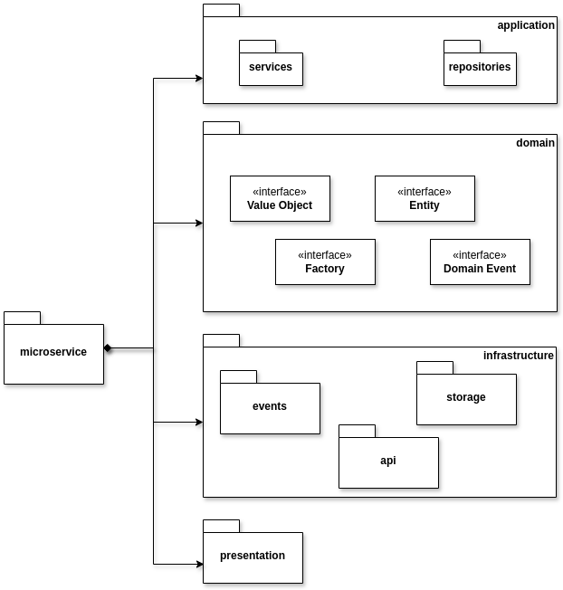

# Microservices

## API Design

Starting from the use cases, we defined the API for each microservice. The API is defined using the OpenAPI Specification.

### Auth service

This microservice is responsible for authentication and authorization. It is responsible for managing user accounts, roles, and permissions. It is also responsible for generating JWT tokens for accessing other services in the system.

<Summary title="Feature: Authentication">

```gherkin
Feature: Authentication

    Scenario: User login
      Given I have a valid username and password
      When I login
      Then I should receive a JWT token
    
    Scenario: User logout
      Given I am logged in
      When I logout
      Then I should no longer have access to the system
```
</Summary>

[OpenAPI Specification](https://revue-org.github.io/revue/openapi/auth/)

### Alarm service

This microservice is responsible for analyzing the data coming from sensors and cameras and consequently notifying anomalies. In order to recognize anomalies some rule must be defined.
The main operations of this service are those to manage the *security rules*.

<Summary title="Feature: Security Rule Management">

```gherkin
Feature: Security Rule Management

  Scenario: Create a security rule
    Given I am logged in as a Guardian
    When I create a security rule in the system
    Then the alarm service should check the security rule
    And trigger an alarm if the conditions are satisfied

  Scenario: Update a security rule
    Given I am logged in as a Guardian
    When I update a security rule in the system
    Then the alarm service should check the updated security rule
    And trigger an alarm if the new conditions are satisfied

  Scenario: Delete a security rule
    Given I am logged in as a Guardian
    When I delete a security rule from the system
    Then the alarm service should no longer check the deleted security rule
```

</Summary>

[OpenAPI Specification](https://revue-org.github.io/revue/openapi/alarm/)


### User service

This microservice is responsible for managing user data.

<Summary title="Feature: User Management">

```gherkin
Feature: User Management

    Scenario: Create a new user
      Given I am logged in as an Admin
      When I create a new user in the system
      Then the user should be able to access and consult the system
    
    Scenario: Modify user contact information
      Given I am logged in as an Admin
      When I update the contact information for a user
      Then the user’s contact information should be updated in the system
    
    Scenario: Delete a user
      Given I am logged in as an Admin
      When I delete a user from the system
      Then the user should be removed from the system
```

</Summary>

[OpenAPI Specification](https://revue-org.github.io/revue/openapi/user/)

### Location service

Devices can be located in different locations. The system provides the possibility to manage rooms and buildings. 

<Summary title="Feature: Location Management">

```gherkin
Feature: Location Management

    Scenario: Create a new location
      Given I am logged in as an Admin
      When I create a new location in the system
      Then the location should be created in the system
      And I should be able to assign Guardians to it
    
    Scenario: Delete a location
      Given I am logged in as an Admin
      When I delete a location from the system
      Then the location should be removed from the system
      And Guardians should no longer have access to it
```

</Summary>

This microservice is responsible for managing location data.

[OpenAPI Specification](https://revue-org.github.io/revue/openapi/location/)

### Device service

This microservice is responsible for managing devices. It can federate a device, modify their description, enable or disable them, and delete them.

<Summary title="Feature: Device Management">

```gherkin
Feature: Device Management

    Scenario: Federate a device
      Given I am logged in as a Guardian
      When I federate a device in the system
      Then the device should be federated in the system
      And I should be able to consult the device information and access its real-time data

  Scenario: Modify device description
      Given I am logged in as a Guardian
      When I update the description of a device
      Then the device description should be updated in the system

  Scenario: Enable or disable a device
      Given I am logged in as a Guardian
      When I enable or disable a device in the system
      Then the device should be enabled or disabled in the system
      And the device should start or stop producing real-time data accordingly

  Scenario: Delete a device
      Given I am logged in as a Guardian
      When I delete a device from the system
      Then the device should be removed from the system
```

</Summary>

[OpenAPI Specification](https://revue-org.github.io/revue/openapi/device/)

### Recognition service

This microservice provides the capability to recognize people and objects in video streams.
It then sends the recognized data to the alarm service.

This service has no public API.

### Monitoring service

This microservice is the main service that enables the user to monitor the system.

<Summary title="Feature: Real-time Data and Video Streaming Consultation">

```gherkin
Feature: Real-time Data and Video Streaming Consultation

   Scenario: Consult real-time environment data from a specific device
      Given I am logged in as a Guardian
      When I consult the real-time environment data produced by a device with sensing capabilities
      Then I should be able to see the data
      And I should be able to choose the desired monitoring measure
      And I should be able to consult the measurement value and unit

  Scenario: Consult video streaming from a specific device
      Given I am logged in as a Guardian
      When I consult the video streaming produced by a device with video streaming capabilities
      Then I should be able to see the video streaming produced by the device
```

</Summary>

[OpenAPI Specification](https://revue-org.github.io/revue/openapi/monitoring/)

### Notification service

This microservice is responsible for delivering notifications to the user.

<Summary title="Feature: Notification Management">

```gherkin
Feature: Notification Management

    Scenario: Consult system notifications
      Given I am logged in as a Guardian
      When I consult the notifications sent by the system
      Then I should be able to see the notification type, the date, and other notification properties
    
    Scenario: Receive real-time notifications when an alarm is triggered
      Given a security rule is broken
      When an alarm is triggered
      Then I should receive real-time notifications through the specified contacts
      And I should be able to see and consult the notification in real-time
```

</Summary>

[OpenAPI Specification](https://revue-org.github.io/revue/openapi/notification/)

### Log service

This microservice is responsible for logging system events.

<Summary title="Feature: Data and Alarm History Consultation">

```gherkin
Feature: Data and Alarm History Consultation

    Scenario: Consult the history of produced data and triggered alarms
      Given I am logged in as a Guardian
      When I consult the history of produced data and triggered alarms
      Then I should be able to see the history of data and alarms
      And I should be able to take appropriate actions based on the history
```

</Summary>

[OpenAPI Specification](https://revue-org.github.io/revue/openapi/log/)

## Clean Architecture


The design of all relevant microservices follows the **Clean Architecture** pattern. This helped us
in maintaining a core domain design that abstracts away from all technical issues. As showed in the 
picture above, we made use of the following layers:

* **Domain**: DDD entities, value objects, factories, ...
* **Application**: DDD services, repositories, ...
* **Presentation**: Machinery to translate external data representation to domain entities and viceversa.
* **Infrastructure**: Mostly external service implementation, DB interfaces, REST apis, Events managers, ...



