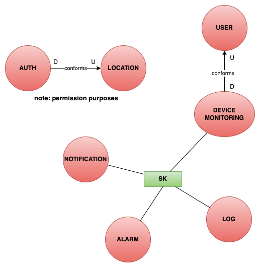

# Bounded Contexts

After the event storming session, the following contexts have been identified:

- Auth
- User
- Monitoring
- Alarm
- Notification
- Location

In the following sections, each context will be described in detail.

## Auth

Responsible for managing the authentication and authorization of the users, however, it is responsible for managing
the permissions of the users.

### Ubiquitous Language

| Term       | Meaning                                                                                                      | Synonyms |
|------------|--------------------------------------------------------------------------------------------------------------|----------|
| Role       | Role assigned to a specific user, only two values are admitted: Admin and Guardian                           | -        |
| Admin      | A user with the maximum level of authority, it can manage permissions of other Guardian users                | -        |
| Guardian   | A user that can only view the video stream and visualize the data produced by sensors to which he has access | Monitor  |
| User       | Either an admin or a guardian                                                                                | -        |
| Permission | A grant to view streams and data from devices in a particular location                                       | -        |

### Events

#### Inbound Events

The Auth bounded context does not receive any event from the other contexts.

#### Outbound Events

- *LocationMonitoringGranted*: event that is sent when a user is granted permission to monitor a location
- *LocationMonitoringDenied*: event that is sent when a user is denied permission to monitor a location
- *UserLoggedIn*: event that is sent when a user is authenticated

## Users

This context is responsible for managing the users of the system,
in particular, nothing regarding the authentication process but only the management of the user registry.

### Ubiquitous Language

| Term         | Meaning                                                                      | Synonyms |
|--------------|------------------------------------------------------------------------------|----------|
| User         | Generic term to refer to anyone registered to the system                     | -        |
| Contact      | Contact on which the specific user will be notified when one anomaly occours | -        |
| Contact Type | Contact type of a single contact, two values are admitted: SMS and EMAIL     | -        |

### Events

#### Inbound Events

The Users bounded context does not receive any event from the other contexts.

#### Outbound Events

- *UserAdded*: sent when a user is created
- *UserDeleted*: sent when a user is updated
- *UserUpdated*: sent when a user is updated
- *UserContactsModified*: sent when a user contact is modified

## Monitoring

It is responsible for managing the devices and the data they produce.
This context is responsible for consulting the data produced by the devices,
their configurations and all about the WoT interactions.

### Ubiquitous Language

| Term                   | Meaning                                                                     | Synonyms                      |
|------------------------|-----------------------------------------------------------------------------|-------------------------------|
| Camera                 | Device that records an environment and transmit the stream to the system    | Video Camera                  |
| Device                 | Device sensing data from an environment (e.g. temperature)                  | -                             |
| Device                 | Either a Camera or a Device                                                 | -                             |
| Device/Camera settings | User-modifiable configuration of data relative to a specific device         | -                             |
| Transmission interval  | The amount of time between to consecutive measurement transmission          | -                             |
| Capability             | What a sensor is able to perceive and transmit                              | -                             |
| Video Stream           | Stream of video data produced by a camera                                   | Stream, Transmission          |
| Measurement            | Data produced by a sensor                                                   | Environment data, Device data |
| Sensor                 | Device sensing data from an environment (e.g. temperature)                  | -                             |
| Device                 | Either a Camera or a Sensor                                                 | -                             |
| Sensor/Camera settings | User-modifiable configuration of data relative to a specific device         | -                             |
| Transmission interval  | The amount of time between to consecutive measurement transmission          | -                             |
| Capability             | What a sensor is able to perceive and transmit                              | -                             |
| Video Stream           | Stream of video data produced by a camera                                   | Stream, Transmission          |
| Measurement            | Data produced by a sensor                                                   | Environment data, Sensor data |
| Numerical measurement  | A `Measurement` with a single numerical value and a `Measurement Type`      | -                             |
| Measurement Type       | A physical dimension with its unit of measure (e.g. temperature in Celsius) | -                             |

### Events

#### Inbound Events

- *MeasurementReceived*: triggered when a device sends a new measurement
- *VideoStreamReceived*: triggered when a camera sends the video stream

#### Outbound Events

- *DeviceAdded*: sent when a device is added
- *DeviceDeleted*: sent when a device is deleted
- *DeviceSettingsModified*: sent when some device settings are modified
- *DeviceEnabled*: sent when a device is enabled
- *DeviceDisabled*: sent when a device is disabled
- *MeasurementStored*: sent when a measurement is stored

## Alarm

Responsible for managing the alarms in the overall system. It is also responsible for the object recognition feature of
the system.

### Ubiquitous Language

| Term           | Meaning                                                                                                       | Synonyms         |
|----------------|---------------------------------------------------------------------------------------------------------------|------------------|
| Security rule  | A condition that if not satisfied will trigger an anomaly                                                     | Rule             |
| Intrusion rule | A condition that specify that in a video stream no object of a specific object class can be recognized        | -                |
| Object class   | Type of object that the system is able to recognize                                                           | Category, Object |
| Range rule     | A condition that will trigger an Outlier if the value of a Numerical measurement is out of a determined range | -                |
| Anomaly        | Is either an intrusion or an outlier                                                                          | -                |
| Detection      | Recognition of an object                                                                                      | -                |
| Intrusion      | Detection of an object in contrast with a particular `Intrusion rule`                                         | -                |
| Outlier        | Numerical measurement with a value in contrast with a particular `Range rule`                                 | -                |

### Events

#### Inbound Events

- *MeasurementReceived*: triggered when a device sends a new measurement
- *VideoStreamReceived*: triggered when a camera sends the video stream

#### Outbound Events

- *SecurityRuleAdded*: sent when a security rule is added
- *SecurityRuleDeleted*: sent when a security rule is deleted
- *SecurityRuleModified*: sent when a security rule is modified
- *SecurityRuleEnabled*: sent when a security rule is enabled
- *SecurityRuleDisabled*: sent when a security rule is disabled
- *SecurityRuleViolation*: sent when a security rule is violated
- *AnalyzingStarted*: sent when the system starts analyzing a video stream
- *ObjectDetected*: sent when an object is detected in a video frame
- *AnomalyDetected*: sent when an anomaly is detected
- *AnomalyStored*: sent when an anomaly is stored

## Location

Responsible for the location management of the system.

### Ubiquitous Language

| Term     | Meaning                                                                                         | Synonyms |
|----------|-------------------------------------------------------------------------------------------------|----------|
| Building | Coarse grained concept of location referring to a structure (e.g. home, warehouse)              | -        |
| Room     | Fine grained concept of location referring to a single space (e.g. living room, entrance, exit) | -        |
| Location | Generic term to refer to a place                                                                | -        |

### Events

#### Inbound Events

The Location bounded context does not receive any event from the other contexts.

#### Inbound Events

- *LocationAdded*: sent when a new location is added
- *LocationRemoved*: sent when a location is removed

## Notification

Responsible for managing the notifications of the system.
It is responsible for sending notifications to the users
when particular events occur.

### Ubiquitous Language

| Term                   | Meaning                                         | Synonyms |
|------------------------|-------------------------------------------------|----------|
| Notification           | Message sent to a `User` using its `Recipient`s | Alert    |
| Outlier Notification   | Notification regarding an Outlier anomaly       | -        |
| Intrusion Notification | Notification regarding an Intrusion anomaly     | -        |
| Notification Type      | Type of notification                            | -        |
| Real-time Notification | Notification sent in real-time to the frontend  | -        |
| Recipient              | The notification target user's contact          |          |

### Events

#### Inbound Events

- *AnomalyDetected*: received when an anomaly is detected

#### Outbound Events

- *NotificationSent*: sent when a notification is sent

## Model Integrity Patterns

Each bounded context is isolated and has its own vision of domain entities. For this reason, 
is necessary to define model integrity patterns to ensure that the data is consistent across the contexts.

In the following are listed the DDD patterns used in the system:

- **Shared Kernel**: that collects the shared entities between the contexts (Domain Events and some common Entities)
- **Conformist**: that allows the contexts to share the same entity but with different representations

## Context Map
The following context map shows the relationships between the contexts.

