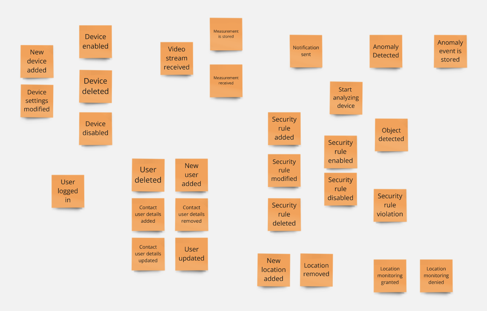
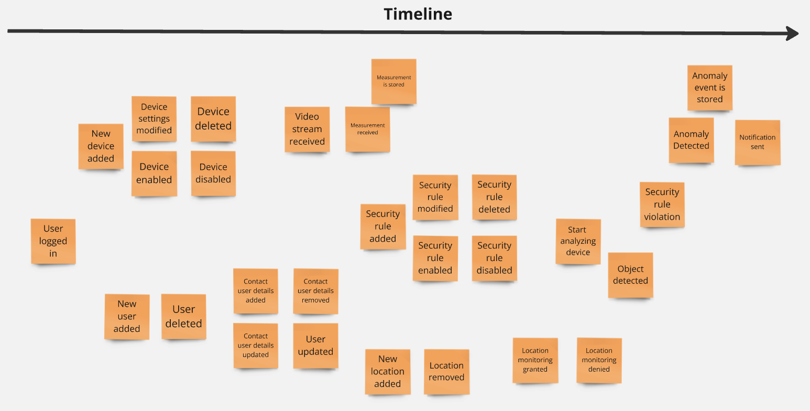
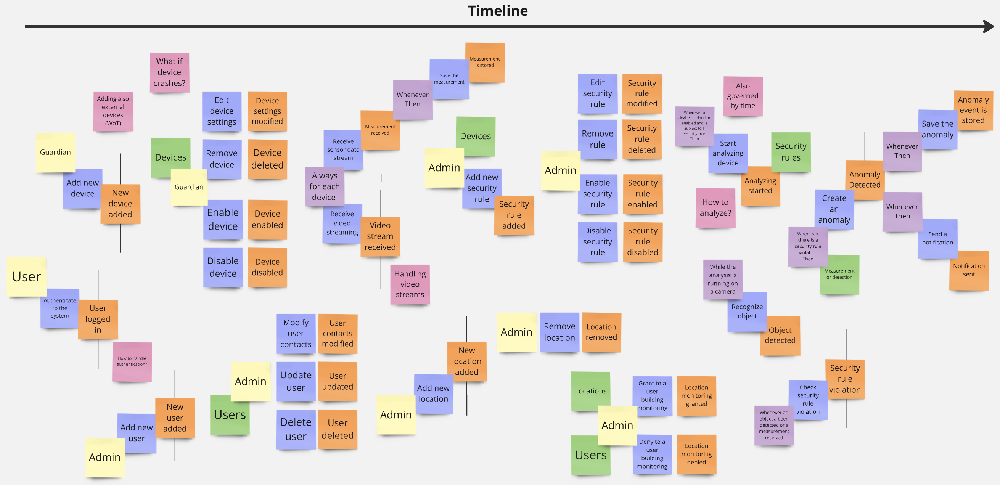
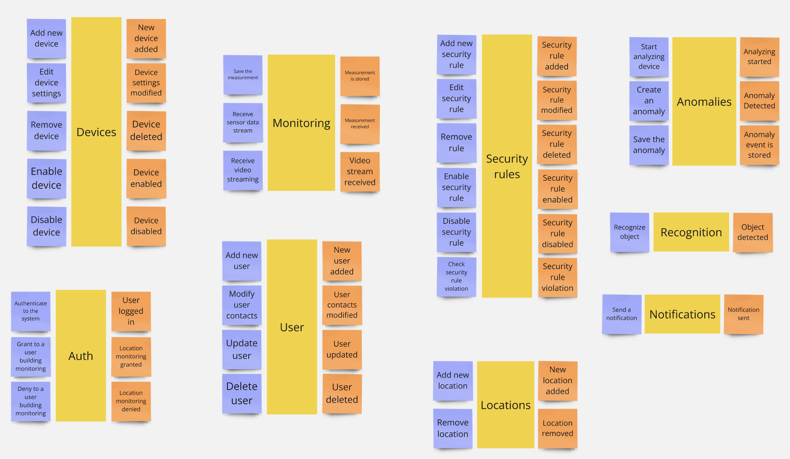
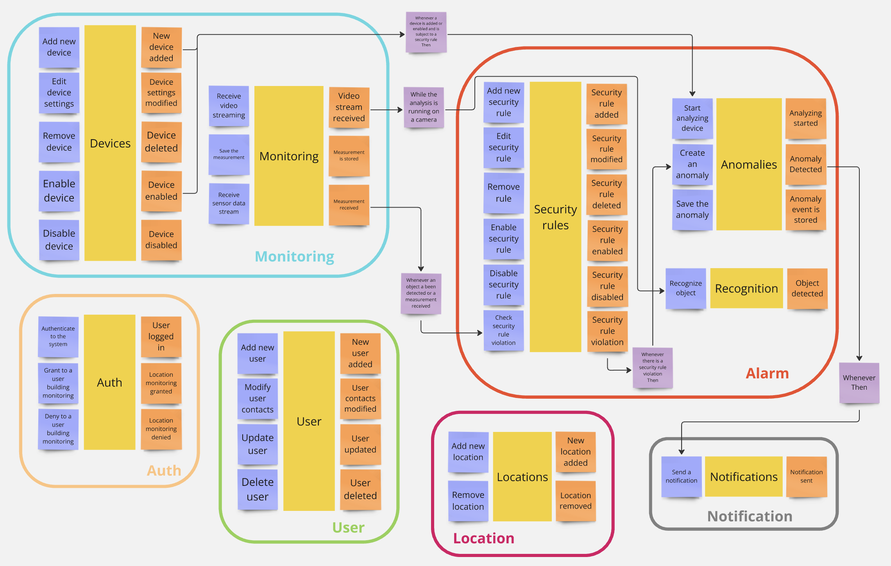

# Event Storming

[Event Storming](https://www.eventstorming.com/) is a workshop format for quickly exploring complex business domains.
It was created by Alberto Brandolini.
The goal of Event Storming is to create a shared understanding of a domain and to identify potential problems and
opportunities.

Event Storming is composed of a series of activities that are performed in a specific order.
In the following, are presented the results of these activities.
For conciseness, some steps have been collapsed into a single section.

## Unstructured Exploration

Firstly, the domain is explored in an unstructured way.
The goal is to identify the main events (orange notes), without any particular
order.

## Timeline

Then, the events are ordered in a timeline.

## Pivotal Events and Pain Points

At this point, the team has discussed critical points that require attention (pink
notes).

Also, the team reasoned about the pivotal events (orange notes with black line),
which are events with a significant impact on the domain, they are a possible symptom of a bounded context division.

## Actors, Commands, Policies and Read Models

In these steps, the team has identified the following elements:
- **Commands** (blue notes): actions that trigger events.
- **Actors** (yellow notes): entities that perform commands.
- **Policies** (purple notes): rules that trigger events, no actor is involved.
- **Read Models** (green notes): data that is read in a particular context.

## Aggregates

The team collected related events and grouped them into aggregates.

## Bounded Contexts

Finally, the team has identified the bounded contexts basing on the aggregates and interactions between them.

