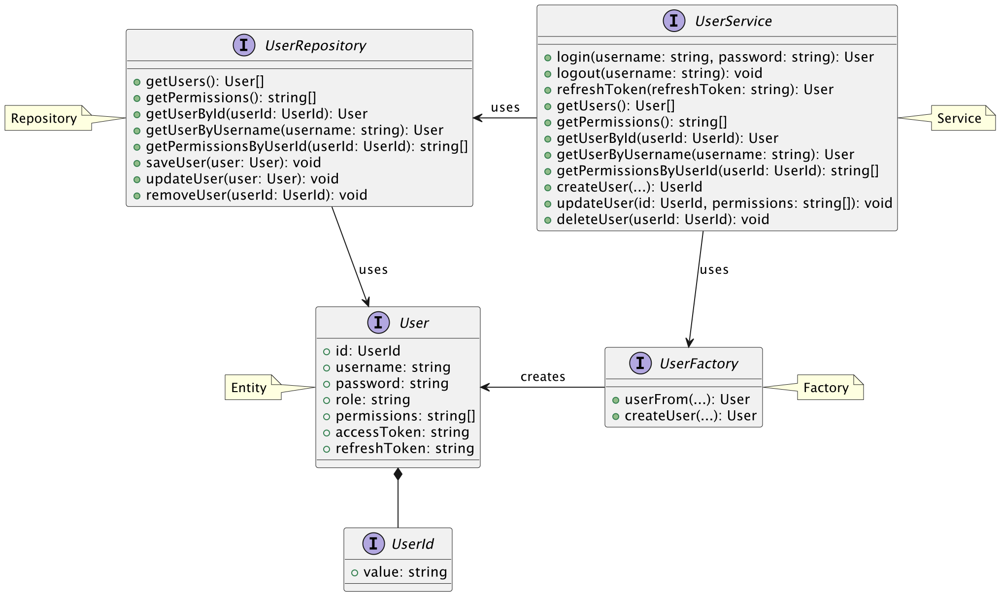
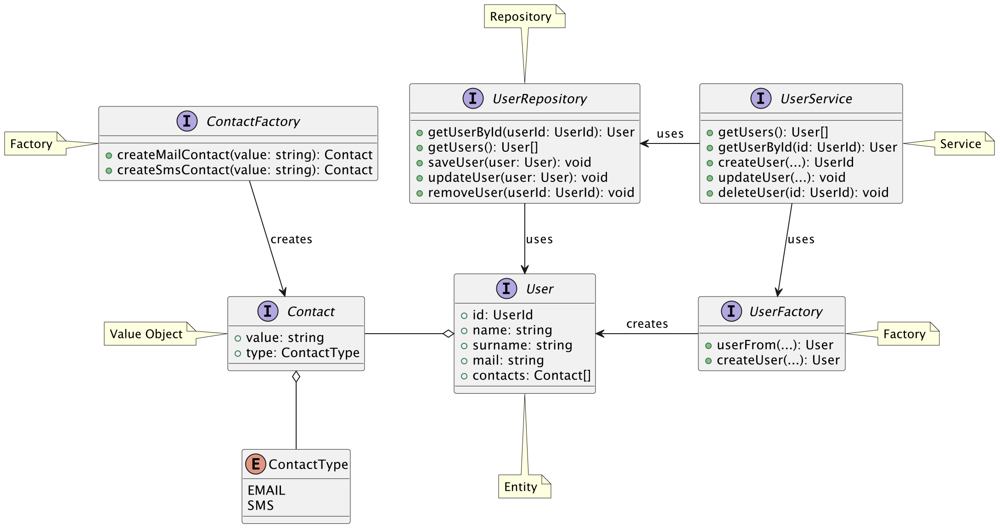
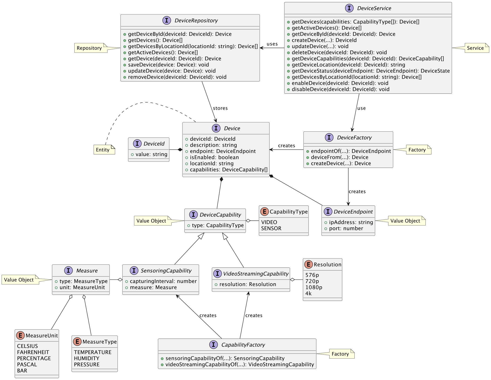
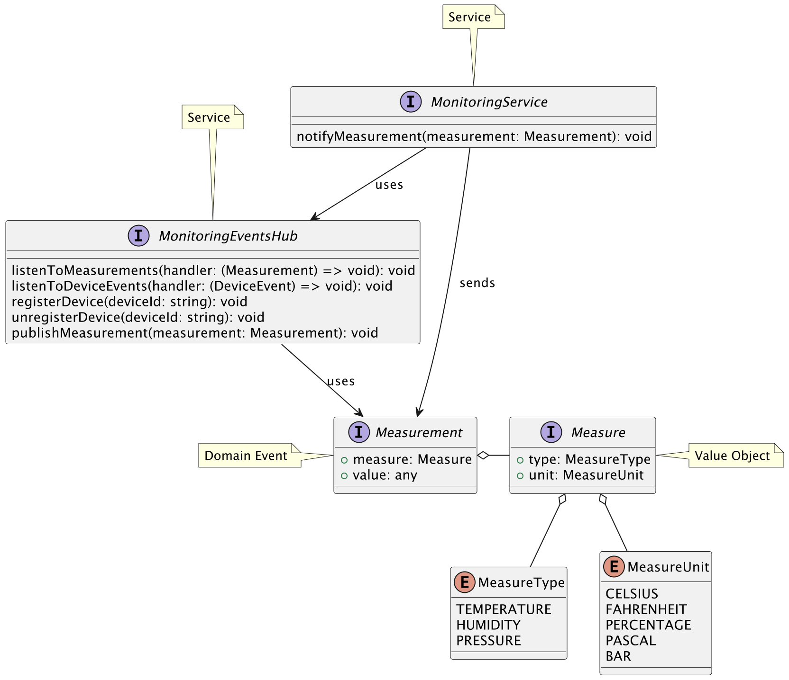
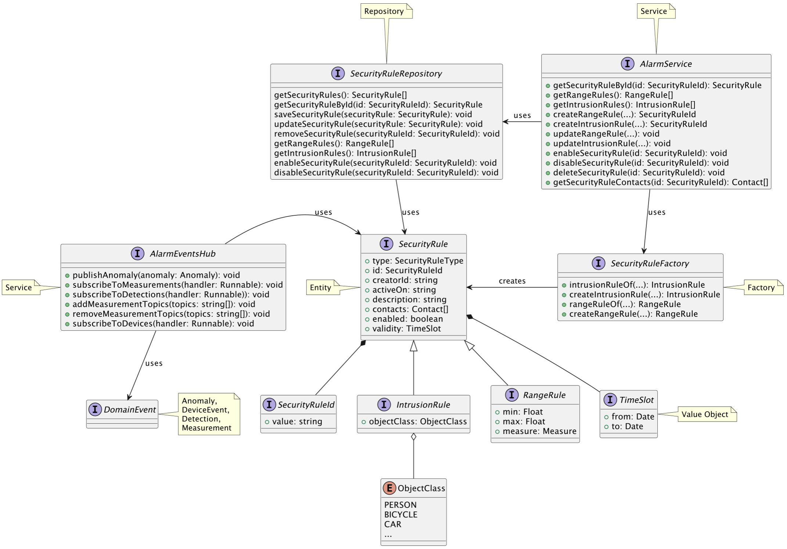
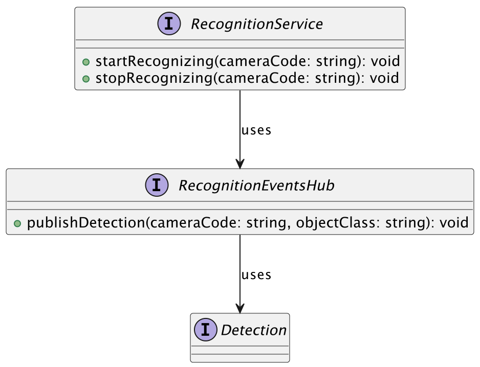
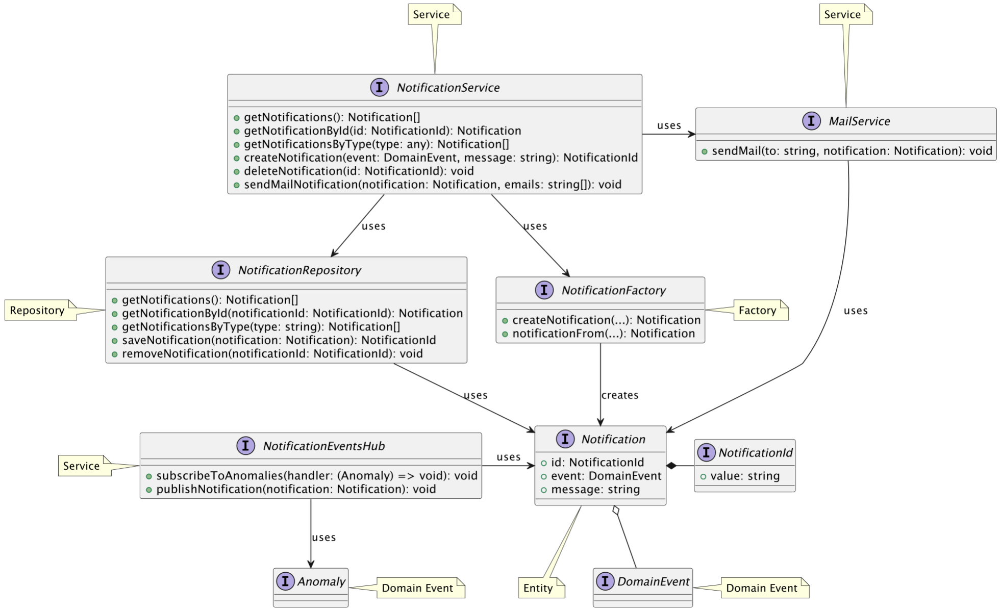
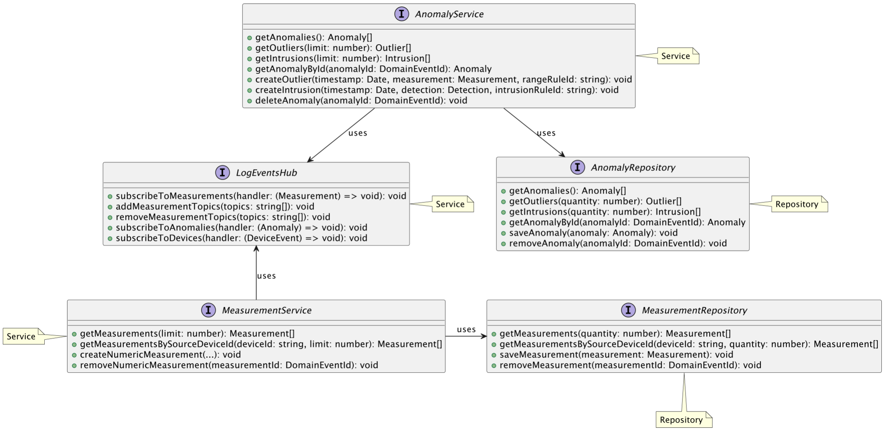

# Detailed Design

N.B. In the diagrams of this section, interface notation has been used to represent the main concepts, however this will
then be encoded appropriately based on the microservice technology.

## Packages

Each microservice has a package structure that is similar to the following:

## Domain Events

All domain events are part of the **Shared Kernel** and are used by all microservices.
The following diagram shows the domain events used in the system:

<Image
src={require('./img/uml/domain-events.png').default}
align="center"
width="70%"
/>

## Microservices

### Auth

The Auth microservice is responsible for managing the authentication and authorization of users.
**User** entity here, has a focus on the authentication and authorization mechanisms.

### User

The User microservice is responsible for managing user data.
The vision of the **User** entity here is different from the Auth microservice, as it focuses on the user's personal
data.

### Device

The Device microservice is responsible for managing the devices.
The focus here is on the **Capability** concept, which allows the device to have multiple and flexible types of
functionalities.

Moreover, **DeviceService** has an important role because it encapsulates the business logic for the device management
and connection using Web of Things (WoT) standard.

### Monitoring

The Monitoring microservice has the responsibility of continuously listening to the devices and collecting the data.

### Alarm

### Recognition

### Notification

### Log

