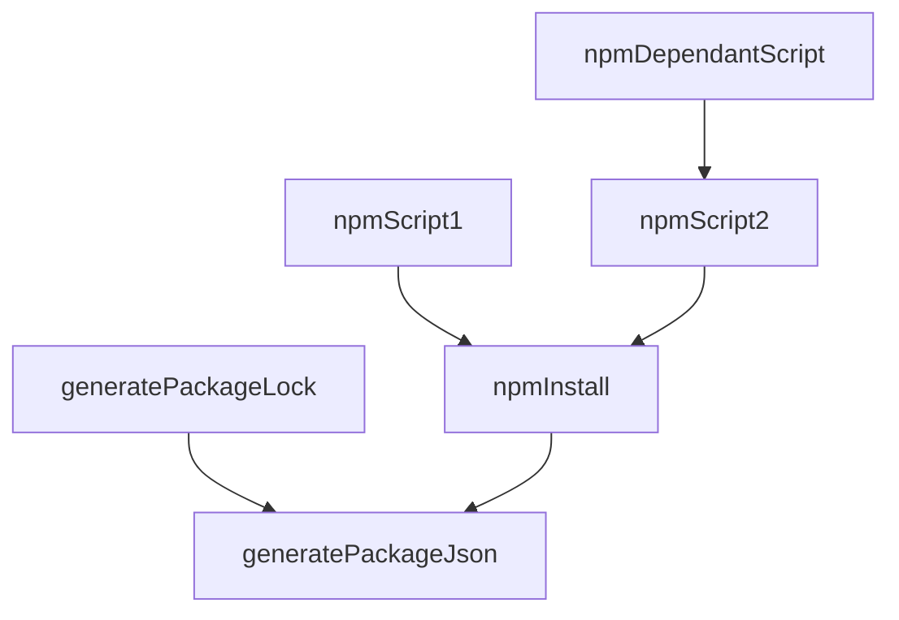
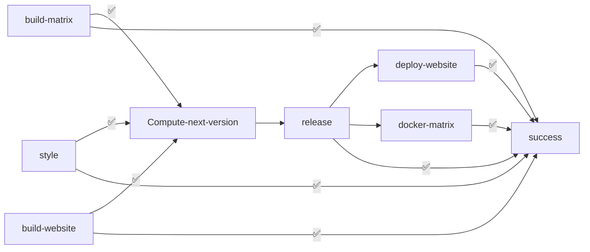

# DevOps

## Build automation

### NPM gradle plugin

We use this gradle [plugin](https://github.com/kelvindev15/npm-gradle-plugin) as an empowerment of the *Node package manager*.
This enabled us to manage npm projects via gradle and thus leveraging some of this latter build tool. The plugin is configured
via its `packageJson` extension in which you can specify some of the most common *package.json* properties that include 
**dependencies**, **devDependencies** and **scripts**.

Here's an example

```kotlin
packageJson {

    packageJson {
        author = "Developer"
        name = "test-package"
        version = "1.0.0"
        description = "This is just a test package"
        main = "index.js"
        license = "MIT"
        scripts {
            script("script1" runs "echo script1")
            script("script2" runs "echo script2")
            script("dependantScript" runs "echo dependantScript" dependingOn listOf(npmScript("script2")))
        }
        dependencies {
            "express" version "^4.17.1"
        }
        devDependencies {
            "nodemon" version "^2.0.7"
        }
        repository = "git" to "https://github.com/kelvindev15/npm-gradle-plugin"
        homepage = "page.github.io"
    }
}
```
The plugin the provides some task to work with npm. For each declared *script* a correspondent `npmScript` is created.
It gives the possibility to declare dependencies among scripts and tasks. It also give the possibility to declare script **inputs** and
**outputs** for task execution optimization. Feature that are available in gradle and not npm.

The previous example will generate the following task graph:



### Dependencies management

We used [Renovate](https://docs.renovatebot.com/) in order to keep all dependencies automatically up-to-date.
Since for most the subproject we are using the `npm-gradle-plugin` we had to define a custom manager:

```json
{
  "customManagers": [
    {
      "datasourceTemplate": "npm",
      "customType": "regex",
      "fileMatch": [
        "(^|\\/).*\\.gradle\\.kts$"
      ],
      "matchStrings": [
        "(?:\"(?<packageName>[^\\s\"]+)\"\\s*version\\s*\"(?<currentValue>.+)\")",
        "(?:\"(?<packageName>[^\\s\"]+)\"\\s*[.]\\s*version\\s*\\(\\s*\"(?<currentValue>.+)\"\\s*\\))"
      ]
    }
  ]
}
```

In this way we instructed Renovate to look for **npm** dependencies in the `gradle.kts` files and update them accordingly.

## Version control

#### DVCS workflow

We chose to maintain a single stable branch, the `main` branch. It contains the working code. 
Changes are made in dedicated branches (*feature/name*, *fix/name*, *chore/what*, etc.) and then merged into the `main` 
branch via pull requests. The pull requests are reviewed and approved by at least one other developer before being merged.
Release are made on the `main` branch.

#### Conventional commits

We use [Conventional Commits](https://www.conventionalcommits.org/en/v1.0.0/) to ensure that the commit messages are consistent and informative.

#### Semantic versioning and release

We use [Semantic Versioning](https://semver.org/) to version the software. 
The version number is computed automatically by the CI/CD pipeline. In particular we use 
the [Semantic Release](https://github.com/semantic-release/semantic-release) plugin to automate the release process. The
plugin looks at the (conventional) commit messages and determines the next version of the software based on the changes introduced in the codebase.
It also generates a changelog and creates a new release on GitHub.


## Quality Assurance

The following tool are run over the codebase on every CI workflow:

* [**Prettier**](https://prettier.io/): a code formatter with support for many languages.
* [**ESLint**](https://eslint.org/): a static code analysis tool for identifying problematic patterns found in JavaScript code.
* [**Codefactor**](https://www.codefactor.io/): a tool that automatically reviews code style, security, duplication, complexity, and coverage on every pull request.
* [**SonarCloud**](https://www.sonarsource.com/products/sonarcloud/): a cloud-based code quality and security service that finds bugs and vulnerabilities in your code.
* [**Codacy**](https://www.codacy.com/): an automated code review tool that helps developers to save time in code reviews and to tackle technical debt efficiently.

## Continuous Integration and Delivery

In order to ensure that whenever some changes are pushed to the repository the project is in a stable state, and possibly release a new version
of the software, we designed a CI/CD pipeline that runs on each push to the repository. To achive this goal we make use of GitHub Actions.

### The CI/CD pipeline

Here's the list of jobs that constitute the [CI pipeline](https://github.com/revue-org/revue/blob/main/.github/workflows/CI-CD.yml):

- `build`: This job is responsible for building the project. After that it runs the automated tests. 
This job runs on: `Linux`, `Windows` and `macOS`.
- `style`: This job is responsible for analyzing the code style and formatting making use of linters and formatters.
- `build_website`: Generates the documentation website. It serves as a way to ensure that on the next release the 
website can be correctly generate without errors. To avoid building the website more than once (in case of a release), 
the website artifact is uploaded and stored available for any future needs.
- `compute_next_version`: This job is responsible for computing the next version of the project. It will be used later in release jobs.
- `release`: Looks at commits message and determines if a [release](https://github.com/revue-org/revue/releases) should be triggered and in case tags the actual state of the repository with the new version number.
- `deploy_website`: Downloads the previously built website artifact and deploys it to the [GitHub Pages](https://revue-org.github.io/revue/).
- `docker`: If a release is triggered, builds the Docker image for all microservices and pushes them to the [Docker Hub](https://hub.docker.com/u/letsdothisshared).



#### Mergify

We use [Mergify](https://mergify.io/) to automatically merge pull requests when all the checks are passed. 
We also the following features:

* **Merge queue**: Mergify will stack new PR in a queue and merge them all together if all status check pass.
* **Branch protection**: Mergify provides a github status check that will fail is some defined rules and conditions are not met.
* **Automatic rebasing**: Mergify will automatically rebase the pull requests when the base branch is updated.

## License
